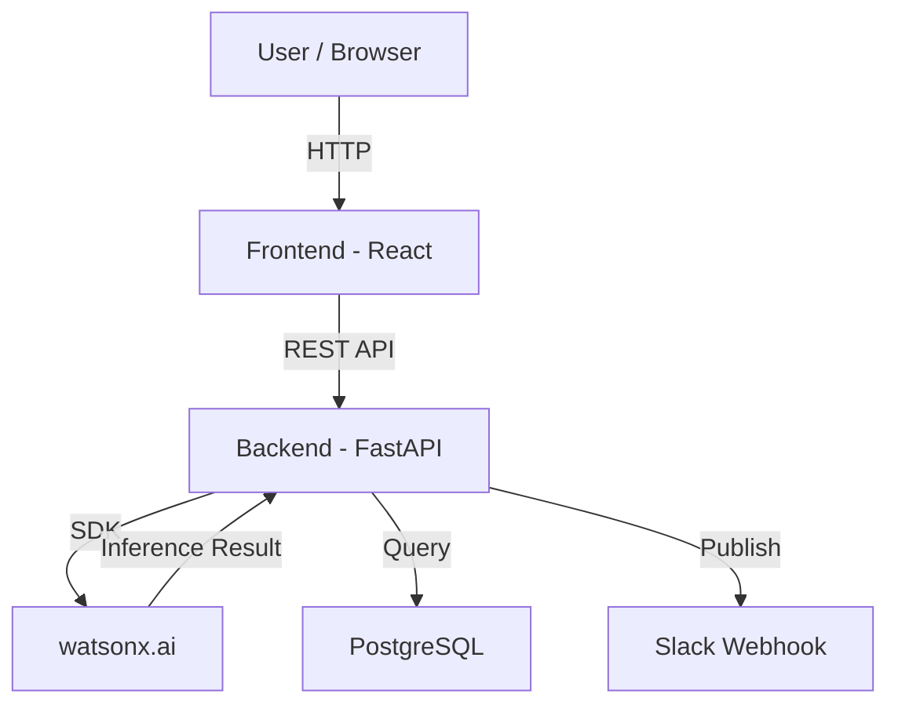

# Architecture

## System Architecture

graph TD
    A[Logistics Operator / Web Browser] -->|HTTP / Static Assets| B[Frontend Dashboard - JS/HTML/CSS]
    B -->|REST API Requests| C[Backend Service - FastAPI/Flask Stack]
    C -->|Telemetry Validation| D[Data Schemas & Models]
    C -->|Relational Queries| E[Database Layer - SQL]
    C -->|Risk & Thermal Analysis| F[IBM watsonx.ai Engine]
    F -->|Inference & Predictions| C

## Components

| Component | Technology | Responsibility |
|---|---|---|
| Frontend |Vanilla JavaScript, HTML5, CSS3 | Render single-pane-of-glass dashboard, route visualizers, live fleet metrics, and threat alerts |
| Backend API | Python FastAPI / Flask | Process incoming telemetry, handle application routing, validate payloads, and execute core optimization logic. |
| API | Python | Execute dedicated logic for thermal excursion monitoring, hazard mitigation, asset management, and shipment state tracking. |
| Database | SQL / SQLite / PostgreSQL | Maintain persistent relational records for asset locations, thermal thresholds, active routes, and historical logs. |
| AI Integration | IBM BOB | Analyze historical route hazards and ambient conditions to predict disruptions and thermal breach risks before failure occurs. |

## Data Flow

[Describe how data moves through your system from input to output.]

1. Telemetry and location data from active cargo, containers, and fleet assets arrive at the backend via modular REST endpoints.
2. Incoming payloads are validated against strict data schemas (schemas.py) and stored in the database via ORM models.
3. The disruption and cold-chain engines (disruptions.py, cold_chain.py) evaluate sensor readings against route conditions and thermal safety limits.
4. Predictive risk profiles are computed through IBM watsonx.ai to identify high-risk routes and recommend asset reallocations.
5. The frontend dashboard (app.js) polls the backend API to update live shipment maps, asset availability, and real-time hazard alerts for operators.

## Security Considerations

- Sensitive application configuration and database credentials are managed exclusively via environment variables using .env.example templates and never checked into source control.
- Clean repository isolation is enforced through .gitignore to prevent compiled Python artifacts (__pycache__) or local secrets from leaking into deployment builds.
- Input validation is strictly enforced at the API boundary using structured schemas (schemas.py) to prevent malformed telemetry or SQL injection vulnerabilities.

## Scalability Notes

The backend architecture is stateless, allowing multiple API instances (run.py) to run behind a load balancer on IBM Cloud Code Engine. Relational database performance can be scaled horizontally using PostgreSQL read replicas for heavy telemetry queries, while batching inference requests to IBM watsonx.ai maintains high throughput during network-wide disruption events.
